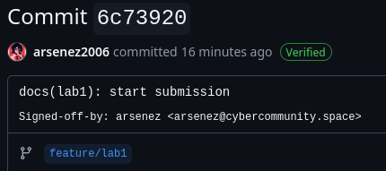

# Lab 1 submission
### `curl` output:
- `GET /health`:
```json
{
    "notes": 5,
    "status": "ok"
}
```
- `GET /notes`:
```json
[
    {
        "id": 3,
        "title": "DevOps mantra",
        "body": "If it hurts, do it more often.",
        "created_at": "2026-01-15T10:10:00Z"
    },
    {
        "id": 4,
        "title": "Endpoint cheat-sheet",
        "body": "GET /notes  GET /notes/{id}  POST /notes  DELETE /notes/{id}  GET /health  GET /metrics",
        "created_at": "2026-01-15T10:15:00Z"
    },
    {
        "id": 5,
        "title": "hello",
        "body": "first POST",
        "created_at": "2026-06-07T06:39:16.391846952Z"
    },
    {
        "id": 1,
        "title": "Welcome to QuickNotes",
        "body": "This is the project you'll containerize, deploy, monitor, and harden across all 10 labs.",
        "created_at": "2026-01-15T10:00:00Z"
    },
    {
        "id": 2,
        "title": "Read app/main.go first",
        "body": "Start by understanding the entry point \u2014 env vars, signal handling, graceful shutdown.",
        "created_at": "2026-01-15T10:05:00Z"
    }
]
```
- `POST /notes`:
```json
{
    "id": 6,
    "title": "hello",
    "body": "first POST",
    "created_at": "2026-06-07T06:57:12.010597168Z"
}
```

### Signed commit
```
commit 6c73920a1fdc3a3e0fdee25992fce10750a28b21 (HEAD -> feature/lab1, origin/feature/lab1)
Good "git" signature for arsenez@cybercommunity.space with ED25519 key SHA256:2J3M7ENdm13QZIlzpxyzXRyoz6dEuk9j8zLyMQigQ40
Author: arsenez <arsenez@cybercommunity.space>
Date:   Sun Jun 7 09:41:51 2026 +0300

    docs(lab1): start submission
    
    Signed-off-by: arsenez <arsenez@cybercommunity.space>
```


### Signed commit explanation
The March 2024 XZ Utils supply chain crisis highlighted that source code and release tarballs can be subtly manipulated when a project's maintainer account is compromised or taken over by a malicious actor (like "Jia Tan"). Signed commits matter because they use cryptographic verification to guarantee a commit genuinely originated from a trusted developer rather than an impersonator or a compromised account. By establishing a clear, unforgeable chain of custody, code signing ensures that unauthorized or highly suspicious changes can be immediately flagged before they are bundled into downstream software distributions.
